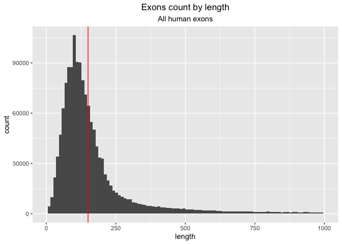
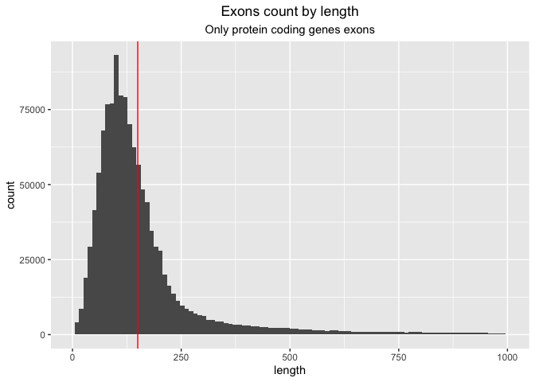
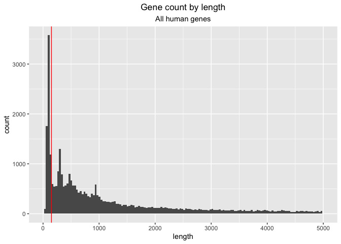
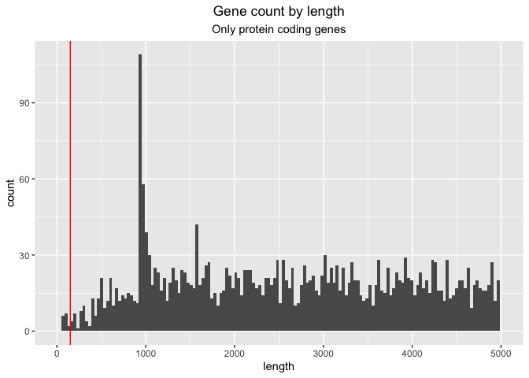

Creating library of human exons and genes
================

## Prepare the environment

``` r
library(tidyverse)
```

    ## ── Attaching core tidyverse packages ──────────────────────── tidyverse 2.0.0 ──
    ## ✔ dplyr     1.1.0     ✔ readr     2.1.4
    ## ✔ forcats   1.0.0     ✔ stringr   1.5.0
    ## ✔ ggplot2   3.4.1     ✔ tibble    3.2.0
    ## ✔ lubridate 1.9.2     ✔ tidyr     1.3.0
    ## ✔ purrr     1.0.1     
    ## ── Conflicts ────────────────────────────────────────── tidyverse_conflicts() ──
    ## ✖ dplyr::filter() masks stats::filter()
    ## ✖ dplyr::lag()    masks stats::lag()
    ## ℹ Use the ]8;;http://conflicted.r-lib.org/conflicted package]8;; to force all conflicts to become errors

``` r
library(ggpubr)
library(Biostrings)
```

    ## Loading required package: BiocGenerics
    ## 
    ## Attaching package: 'BiocGenerics'
    ## 
    ## The following objects are masked from 'package:lubridate':
    ## 
    ##     intersect, setdiff, union
    ## 
    ## The following objects are masked from 'package:dplyr':
    ## 
    ##     combine, intersect, setdiff, union
    ## 
    ## The following objects are masked from 'package:stats':
    ## 
    ##     IQR, mad, sd, var, xtabs
    ## 
    ## The following objects are masked from 'package:base':
    ## 
    ##     anyDuplicated, aperm, append, as.data.frame, basename, cbind,
    ##     colnames, dirname, do.call, duplicated, eval, evalq, Filter, Find,
    ##     get, grep, grepl, intersect, is.unsorted, lapply, Map, mapply,
    ##     match, mget, order, paste, pmax, pmax.int, pmin, pmin.int,
    ##     Position, rank, rbind, Reduce, rownames, sapply, setdiff, sort,
    ##     table, tapply, union, unique, unsplit, which.max, which.min
    ## 
    ## Loading required package: S4Vectors

    ## Warning: package 'S4Vectors' was built under R version 4.2.2

    ## Loading required package: stats4
    ## 
    ## Attaching package: 'S4Vectors'
    ## 
    ## The following objects are masked from 'package:lubridate':
    ## 
    ##     second, second<-
    ## 
    ## The following objects are masked from 'package:dplyr':
    ## 
    ##     first, rename
    ## 
    ## The following object is masked from 'package:tidyr':
    ## 
    ##     expand
    ## 
    ## The following objects are masked from 'package:base':
    ## 
    ##     expand.grid, I, unname
    ## 
    ## Loading required package: IRanges
    ## 
    ## Attaching package: 'IRanges'
    ## 
    ## The following object is masked from 'package:lubridate':
    ## 
    ##     %within%
    ## 
    ## The following objects are masked from 'package:dplyr':
    ## 
    ##     collapse, desc, slice
    ## 
    ## The following object is masked from 'package:purrr':
    ## 
    ##     reduce
    ## 
    ## Loading required package: XVector
    ## 
    ## Attaching package: 'XVector'
    ## 
    ## The following object is masked from 'package:purrr':
    ## 
    ##     compact
    ## 
    ## Loading required package: GenomeInfoDb

    ## Warning: package 'GenomeInfoDb' was built under R version 4.2.2

    ## 
    ## Attaching package: 'Biostrings'
    ## 
    ## The following object is masked from 'package:base':
    ## 
    ##     strsplit

Download the human reference genome and the human gene annotation from
<https://www.gencodegenes.org/human/release_38.html>.

- **Genome sequence (GRCh38.p13)**
- **Comprehensive gene annotation**

Package used: **BEDOPS**. Before conversion, extract the file.

    gtf2bed < /Volumes/Temp1/Exons/gencode.v35.annotation.gtf > /Volumes/Temp1/Exons/gencode.v35.annotation.bed

## Exon library preparation

### All exons

Select only the exons and add to the output file the name of the gene.
Then remove the “;” at the end of each line with **sed**.

    awk '{ if ($8 == "exon") print $1 "\t" $2 "\t" $3 "\t" $4 "\t" $23}' /Volumes/Temp1/Exons/gencode.v35.annotation.bed > /Volumes/Temp1/Exons/exons_raw.bed

    sed 's/;$//' /Volumes/Temp1/Exons/exons_raw.bed > /Volumes/Temp1/Exons/exons.bed

With the created file with exons and chromosomal position, create a
fasta file extracting the sequences from the reference genome file
(extracted).

    bedtools getfasta -fi /Volumes/Temp1/Exons/GRCh38.p13.genome.fa -bed /Volumes/Temp1/Exons/exons.bed -name -split -s -fo /Volumes/Temp1/Exons/exons.fa

``` r
library <- readDNAStringSet("/Volumes/Temp1/human-genes/exons/exons.fa")
names <- names(library) %>% as_tibble()
df <- as.data.frame(library) %>% as_tibble() %>% mutate(length = nchar(as.character(x))) %>% select(length)
exons <- bind_cols(names, df) %>% dplyr::rename("sequence"=value) %>% arrange(desc(length))

ggplot(exons, aes(length))+
  geom_histogram(bins = 100)+
  xlim(0, 1000)+
  geom_vline(xintercept = 150, col = "red")+
  ggtitle("Exons count by length")+
  labs(subtitle = "All human exons")+
  theme(plot.title = element_text(hjust = 0.5), plot.subtitle = element_text(hjust = 0.5))
```

    ## Warning: Removed 66844 rows containing non-finite values (`stat_bin()`).

    ## Warning: Removed 2 rows containing missing values (`geom_bar()`).

<!-- -->

``` r
all <- exons %>% summarise(count = n()) %>% pull
lost <- exons %>% filter(length<150) %>% summarise(count = n()) %>% pull
all_bases <- exons %>% summarise(length = sum(length)) %>% pull
lost_bases <- exons %>% filter(length<150) %>% summarise(length = sum(length)) %>% pull

(percentage_exons_lost = (lost/all)*100)
```

    ## [1] 59.55309

``` r
(percentage_bases_lost = (lost_bases/all_bases)*100)
```

    ## [1] 21.36511

59% of the exons are shorter than the HGDP read length (150 bp),
representing 21% of all the bases in the human exons.

### Only protein-coding-genes exons

    awk '{ if ($8 == "exon") print $1 "\t" $2 "\t" $3 "\t" $4 "\t" $15 "\t" $23}' /Volumes/Temp1/human-genes/gencode.v38.annotation.bed > /Volumes/Temp1/human-genes/exons-pcg_raw.bed

    sed 's/\"//g; s/;//g' /Volumes/Temp1/human-genes/exons/exons-pcg_raw.bed > /Volumes/Temp1/human-genes/exons/exons-pcg.bed

    awk '$5 == "protein_coding"' /Volumes/Temp1/human-genes/exons/exons-all.bed > /Volumes/Temp1/human-genes/exons/exons-pcg.bed

``` r
library_exons_pcg <- readDNAStringSet("/Volumes/Temp1/human-genes/exons/exons-pcg.fa")
names_exons_pcg <- names(library_exons_pcg) %>% as_tibble()
df_exons_pcg <- as.data.frame(library_exons_pcg) %>% as_tibble() %>% mutate(length = nchar(as.character(x))) %>% select(length)
exons_exons_pcg <- bind_cols(names_exons_pcg, df_exons_pcg) %>% dplyr::rename("sequence"=value) %>% arrange(desc(length))

ggplot(exons_exons_pcg, aes(length))+
  geom_histogram(bins = 100)+
  xlim(0, 1000)+
  geom_vline(xintercept = 150, col = "red")+
  ggtitle("Exons count by length")+
  labs(subtitle = "Only protein coding genes exons")+
  theme(plot.title = element_text(hjust = 0.5), plot.subtitle = element_text(hjust = 0.5))
```

    ## Warning: Removed 49383 rows containing non-finite values (`stat_bin()`).

    ## Warning: Removed 2 rows containing missing values (`geom_bar()`).

<!-- -->

``` r
all_exons_pcg <- exons_exons_pcg %>% summarise(count = n()) %>% pull
lost_exons_pcg <- exons_exons_pcg %>% filter(length<150) %>% summarise(count = n()) %>% pull
all_bases_exons_pcg <- exons_exons_pcg %>% summarise(length = sum(length)) %>% pull
lost_bases_exons_pcg <- exons_exons_pcg %>% filter(length<150) %>% summarise(length = sum(length)) %>% pull

(percentage_exons_lost_exons_pcg = (lost_exons_pcg/all_exons_pcg)*100)
```

    ## [1] 61.6576

``` r
(percentage_bases_lost_exons_pcg = (lost_bases_exons_pcg/all_bases_exons_pcg)*100)
```

    ## [1] 23.61994

Only considering protein coding genes exons, the percentage of lost
sequences remains similar (61%) as well as the percentage of lost bases
(23%).

## Gene library preparation

### All genes

    awk '{ if ($8 == "gene") print $1 "\t" $2 "\t" $3 "\t" $4 "\t" $13}' /Volumes/Temp1/human-genes/gencode.v38.annotation.bed > /Volumes/Temp1/human-genes/genes_raw.bed

    sed 's/\"//g; s/;//g' /Volumes/Temp1/human-genes/genes_raw.bed > /Volumes/Temp1/human-genes/genes/genes.bed

``` r
library_genes <- readDNAStringSet("/Volumes/Temp1/human-genes/genes/genes.fa")
names_genes <- names(library_genes) %>% as_tibble()
df_genes <- as.data.frame(library_genes) %>% as_tibble() %>% mutate(length = nchar(as.character(x))) %>% select(length)
genes <- bind_cols(names_genes, df_genes) %>% dplyr::rename("sequence"=value) %>% arrange(desc(length))

ggplot(genes, aes(length))+
  geom_histogram(bins = 150)+
  xlim(0, 5000)+
  geom_vline(xintercept = 150, col = "red")+
  ggtitle("Gene count by length")+
  labs(subtitle = "All human genes")+
  theme(plot.title = element_text(hjust = 0.5), plot.subtitle = element_text(hjust = 0.5))
```

    ## Warning: Removed 28152 rows containing non-finite values (`stat_bin()`).

    ## Warning: Removed 2 rows containing missing values (`geom_bar()`).

<!-- -->

``` r
(all_genes <- genes %>% summarise(count = n()) %>% pull)
```

    ## [1] 60649

``` r
lost_genes <- genes %>% filter(length<150) %>% summarise(count = n()) %>% pull
all_bases_genes <- genes %>% summarise(length = sum(length)) %>% pull
lost_bases_genes <- genes %>% filter(length<150) %>% summarise(length = sum(length)) %>% pull

(percentage_genes_lost = (lost_genes/all_genes)*100)
```

    ## [1] 10.85426

``` r
(percentage_bases_lost_genes = (lost_bases_genes/all_bases_genes)*100)
```

    ## [1] 0.03229359

There are 60.000 genes sequences in the library. 10% of the genes are
shorter than the HGDP read length (150 bp), representing only the 0.03%
of all the bases in the human genes.

### Only protein coding genes

``` r
all_genes <- read_tsv("/Volumes/Temp1/human-genes/genes/genes.bed", col_names = c("chr", "start", "end", "name", "type"))
```

    ## Rows: 60649 Columns: 5
    ## ── Column specification ────────────────────────────────────────────────────────
    ## Delimiter: "\t"
    ## chr (3): chr, name, type
    ## dbl (2): start, end
    ## 
    ## ℹ Use `spec()` to retrieve the full column specification for this data.
    ## ℹ Specify the column types or set `show_col_types = FALSE` to quiet this message.

``` r
(per_type <- all_genes %>% group_by(type) %>% dplyr::summarise(count=n()))
```

    ## # A tibble: 40 × 2
    ##    type            count
    ##    <chr>           <int>
    ##  1 IG_C_gene          14
    ##  2 IG_C_pseudogene     9
    ##  3 IG_D_gene          37
    ##  4 IG_J_gene          18
    ##  5 IG_J_pseudogene     3
    ##  6 IG_V_gene         145
    ##  7 IG_V_pseudogene   187
    ##  8 IG_pseudogene       1
    ##  9 Mt_rRNA             2
    ## 10 Mt_tRNA            22
    ## # … with 30 more rows

``` r
format_numeric <- function(x) {
  formatC(x, format = "f", digits = 0)
}

protein_coding <- all_genes %>% filter(type == "protein_coding") %>% select(-type)

formatted_tbl <- protein_coding %>% 
  mutate_if(is.numeric, format_numeric)

#write.table(formatted_tbl, file = "/Volumes/Temp1/human-genes/genes/protein-coding-genes.bed", sep = "\t", row.names = FALSE, col.names = FALSE, quote = FALSE)
```

``` r
library_pcg <- readDNAStringSet("/Volumes/Temp1/human-genes/genes/protein-coding-genes.fa")
names_pcg <- names(library_pcg) %>% as_tibble()
df_pcg <- as.data.frame(library_pcg) %>% as_tibble() %>% mutate(length = nchar(as.character(x))) %>% select(length)
pcg <- bind_cols(names_pcg, df_pcg) %>% dplyr::rename("sequence"=value) %>% arrange(desc(length))

ggplot(pcg, aes(length))+
  geom_histogram(bins = 150)+
  xlim(0, 5000)+
  geom_vline(xintercept = 150, col = "red")+
  ggtitle("Exons count by length")+
  labs(subtitle = "Only protein coding genes")+
  theme(plot.title = element_text(hjust = 0.5), plot.subtitle = element_text(hjust = 0.5))
```

    ## Warning: Removed 17169 rows containing non-finite values (`stat_bin()`).

    ## Warning: Removed 2 rows containing missing values (`geom_bar()`).

<!-- -->

``` r
(all_pcg <- pcg %>% summarise(count = n()) %>% pull)
```

    ## [1] 19955

``` r
lost_pcg <- pcg %>% filter(length<150) %>% summarise(count = n()) %>% pull
all_bases_pcg <- pcg %>% summarise(length = sum(length)) %>% pull
lost_bases_pcg <- pcg %>% filter(length<150) %>% summarise(length = sum(length)) %>% pull

(percentage_pcg_lost = (lost_pcg/all_pcg)*100)
```

    ## [1] 0.07516913

``` r
(percentage_bases_lost_pcg = (lost_bases_pcg/all_bases_pcg)*100)
```

    ## [1] 9.850951e-05

Considering only the **protein coding genes**, the fraction below 150 bp
is really non significant (0.07% for even less % of bases lost). In
total, we have 19955 annotated protein coding genes.
